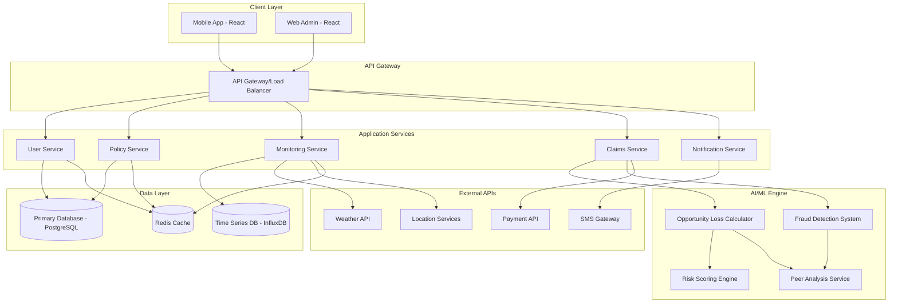
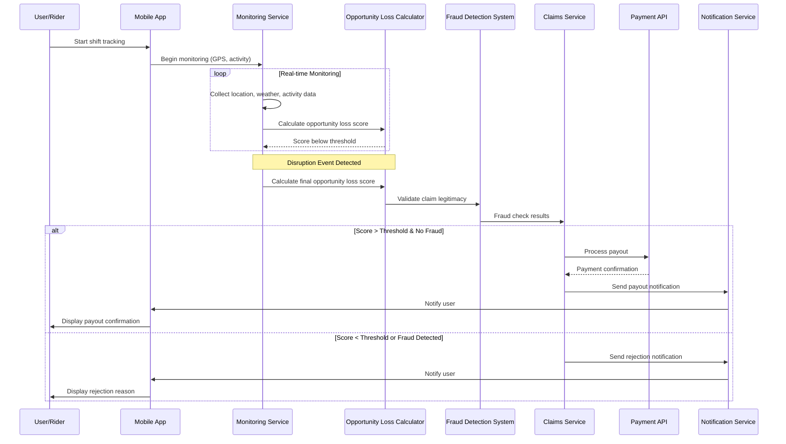
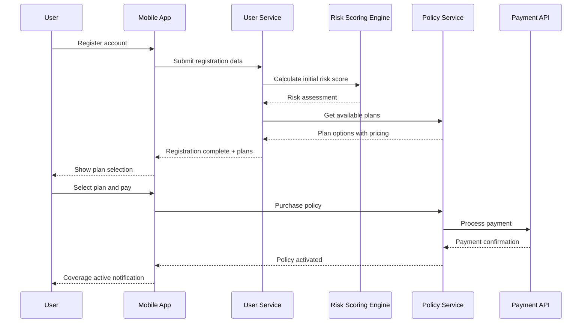

# Design Document: Vytrix Insurance Platform

## Overview

Vytrix is an AI-powered parametric insurance platform designed to protect urban food delivery workers in India from income loss due to external disruptions. The platform uses an innovative "Opportunity Loss Score" algorithm to detect genuine income loss events and automatically trigger payouts while maintaining robust fraud prevention. The system provides flexible shift-aware micro-coverage options (Lunch Peak, Dinner Peak, Full Shift) with weekly risk-based pricing ranging from ₹100-300. The platform combines real-time monitoring, AI/ML-driven risk assessment, and mobile-first user experience to serve gig workers earning approximately ₹600/day who need protection during peak earning hours.

The core innovation lies in the composite Opportunity Loss Score that weighs multiple factors: weather conditions (30%), delivery activity drop (20%), movement patterns (20%), peer activity comparison (15%), and behavioral consistency (15%). This multi-signal approach enables accurate detection of legitimate income loss while preventing fraudulent claims through GPS anomaly detection and peer comparison algorithms.

## Architecture

The Vytrix platform follows a microservices architecture with clear separation between user-facing services, core business logic, AI/ML processing, and external integrations. The system is designed for scalability, real-time processing, and high availability to serve thousands of gig workers simultaneously.



## Sequence Diagrams

### Main Workflow: Claim Processing



### User Registration and Plan Selection


## Components and Interfaces

### Component 1: User Service

**Purpose**: Manages user registration, authentication, profile management, and risk assessment for gig workers.

**Interface**:
```python
class UserService:
    def register_user(self, user_data: UserRegistrationData) -> UserProfile
    def authenticate_user(self, credentials: LoginCredentials) -> AuthToken
    def update_profile(self, user_id: str, profile_data: ProfileData) -> UserProfile
    def get_risk_score(self, user_id: str) -> RiskScore
    def verify_identity(self, user_id: str, documents: List[Document]) -> VerificationStatus
```

**Responsibilities**:
- User registration and KYC verification
- Authentication and session management
- Profile data management and updates
- Initial risk assessment coordination
- Identity document verification

### Component 2: Policy Service

**Purpose**: Handles insurance policy creation, management, pricing, and coverage calculations.

**Interface**:
```python
class PolicyService:
    def create_policy(self, user_id: str, coverage_type: CoverageType) -> Policy
    def calculate_premium(self, user_id: str, coverage_type: CoverageType) -> Premium
    def get_active_policies(self, user_id: str) -> List[Policy]
    def update_policy(self, policy_id: str, updates: PolicyUpdates) -> Policy
    def cancel_policy(self, policy_id: str, reason: str) -> CancellationResult
```

**Responsibilities**:
- Policy creation and lifecycle management
- Premium calculation based on risk factors
- Coverage type management (Lunch Peak, Dinner Peak, Full Shift)
- Policy renewal and cancellation processing
- Coverage validation and limits enforcement

### Component 3: Monitoring Service

**Purpose**: Real-time tracking of user location, activity patterns, and environmental conditions for opportunity loss detection.

**Interface**:
```python
class MonitoringService:
    def start_shift_tracking(self, user_id: str, shift_type: ShiftType) -> TrackingSession
    def update_location(self, session_id: str, location: GPSCoordinate) -> None
    def record_activity(self, session_id: str, activity: ActivityData) -> None
    def get_current_conditions(self, location: GPSCoordinate) -> EnvironmentalConditions
    def end_shift_tracking(self, session_id: str) -> ShiftSummary
```

**Responsibilities**:
- GPS location tracking and validation
- Activity pattern monitoring and analysis
- Weather and environmental data collection
- Shift session management
- Real-time data aggregation and storage

### Component 4: Opportunity Loss Calculator

**Purpose**: Core AI/ML engine that calculates the composite Opportunity Loss Score using multiple weighted factors.

**Interface**:
```python
class OpportunityLossCalculator:
    def calculate_score(self, session_data: ShiftSessionData) -> OpportunityLossScore
    def get_weather_impact(self, weather_data: WeatherData, location: GPSCoordinate) -> float
    def analyze_activity_drop(self, current_activity: ActivityData, historical_data: List[ActivityData]) -> float
    def evaluate_movement_patterns(self, gps_data: List[GPSCoordinate]) -> float
    def compare_peer_activity(self, user_activity: ActivityData, peer_data: PeerActivityData) -> float
    def assess_behavioral_consistency(self, user_id: str, current_behavior: BehaviorData) -> float
```

**Responsibilities**:
- Weather impact assessment (30% weight)
- Delivery activity drop analysis (20% weight)
- Movement pattern evaluation (20% weight)
- Peer activity comparison (15% weight)
- Behavioral consistency scoring (15% weight)
- Composite score calculation and threshold evaluation

### Component 5: Fraud Detection System

**Purpose**: Multi-signal fraud prevention system that validates claim legitimacy through various detection mechanisms.

**Interface**:
```python
class FraudDetectionSystem:
    def validate_claim(self, claim_data: ClaimData) -> FraudAssessment
    def detect_gps_anomalies(self, gps_data: List[GPSCoordinate]) -> List[Anomaly]
    def analyze_behavioral_patterns(self, user_id: str, behavior_data: BehaviorData) -> BehaviorAnalysis
    def cross_reference_peers(self, user_data: UserActivityData, peer_data: PeerActivityData) -> PeerValidation
    def check_historical_claims(self, user_id: str) -> ClaimHistory
```

**Responsibilities**:
- GPS anomaly detection and validation
- Behavioral pattern analysis for fraud indicators
- Peer activity cross-referencing
- Historical claim pattern analysis
- Multi-signal fraud score calculation
- False positive minimization

## Data Models

### Model 1: UserProfile

```python
class UserProfile:
    user_id: str
    phone_number: str
    name: str
    email: Optional[str]
    delivery_platform: DeliveryPlatform  # Swiggy, Zomato, etc.
    vehicle_type: VehicleType  # Bike, Scooter, Bicycle
    primary_work_area: GeographicArea
    average_daily_earnings: float
    risk_score: float
    verification_status: VerificationStatus
    created_at: datetime
    updated_at: datetime
```

**Validation Rules**:
- phone_number must be valid Indian mobile number (10 digits)
- average_daily_earnings must be between ₹200-₹2000
- risk_score must be between 0.0-1.0
- primary_work_area must be within supported cities

### Model 2: Policy

```python
class Policy:
    policy_id: str
    user_id: str
    coverage_type: CoverageType  # LUNCH_PEAK, DINNER_PEAK, FULL_SHIFT
    premium_amount: float
    coverage_amount: float
    start_date: datetime
    end_date: datetime
    status: PolicyStatus  # ACTIVE, EXPIRED, CANCELLED
    payment_frequency: PaymentFrequency  # WEEKLY
    terms_conditions: str
    created_at: datetime
```

**Validation Rules**:
- premium_amount must be between ₹100-₹300 per week
- coverage_amount must not exceed 10x premium_amount
- end_date must be after start_date
- coverage_type must match user's work patterns

### Model 3: OpportunityLossScore

```python
class OpportunityLossScore:
    score_id: str
    user_id: str
    session_id: str
    weather_score: float  # 0.0-1.0, weight: 30%
    activity_drop_score: float  # 0.0-1.0, weight: 20%
    movement_score: float  # 0.0-1.0, weight: 20%
    peer_comparison_score: float  # 0.0-1.0, weight: 15%
    behavioral_score: float  # 0.0-1.0, weight: 15%
    composite_score: float  # Weighted average
    threshold: float  # Dynamic threshold for payout
    calculated_at: datetime
```

**Validation Rules**:
- All individual scores must be between 0.0-1.0
- composite_score = (weather_score * 0.3) + (activity_drop_score * 0.2) + (movement_score * 0.2) + (peer_comparison_score * 0.15) + (behavioral_score * 0.15)
- threshold must be dynamically calculated based on historical data
- calculated_at must be within active shift session

### Model 4: ClaimData

```python
class ClaimData:
    claim_id: str
    user_id: str
    policy_id: str
    session_id: str
    opportunity_loss_score: OpportunityLossScore
    fraud_assessment: FraudAssessment
    claim_amount: float
    status: ClaimStatus  # PENDING, APPROVED, REJECTED, PAID
    reason: Optional[str]
    processed_at: Optional[datetime]
    payout_reference: Optional[str]
    created_at: datetime
```

**Validation Rules**:
- claim_amount must not exceed policy coverage_amount
- opportunity_loss_score.composite_score must exceed threshold for approval
- fraud_assessment.risk_level must be LOW or MEDIUM for approval
- processed_at required when status is not PENDING
## Algorithmic Pseudocode

### Main Processing Algorithm: Opportunity Loss Score Calculation

```pascal
ALGORITHM calculateOpportunityLossScore(sessionData)
INPUT: sessionData of type ShiftSessionData
OUTPUT: score of type OpportunityLossScore

BEGIN
  ASSERT sessionData.isValid() AND sessionData.isActiveSession()
  
  // Step 1: Initialize scoring components
  weatherScore ← calculateWeatherImpact(sessionData.weatherData, sessionData.location)
  activityScore ← calculateActivityDrop(sessionData.currentActivity, sessionData.historicalActivity)
  movementScore ← calculateMovementPatterns(sessionData.gpsData)
  peerScore ← calculatePeerComparison(sessionData.userActivity, sessionData.peerData)
  behaviorScore ← calculateBehavioralConsistency(sessionData.userId, sessionData.behaviorData)
  
  // Step 2: Apply weighted composite scoring
  compositeScore ← (weatherScore * 0.3) + (activityScore * 0.2) + (movementScore * 0.2) + 
                   (peerScore * 0.15) + (behaviorScore * 0.15)
  
  // Step 3: Determine dynamic threshold
  threshold ← calculateDynamicThreshold(sessionData.userId, sessionData.coverageType)
  
  // Step 4: Create score object
  score ← OpportunityLossScore(
    userId: sessionData.userId,
    sessionId: sessionData.sessionId,
    weatherScore: weatherScore,
    activityDropScore: activityScore,
    movementScore: movementScore,
    peerComparisonScore: peerScore,
    behavioralScore: behaviorScore,
    compositeScore: compositeScore,
    threshold: threshold,
    calculatedAt: getCurrentTimestamp()
  )
  
  ASSERT score.compositeScore >= 0.0 AND score.compositeScore <= 1.0
  ASSERT score.threshold > 0.0 AND score.threshold <= 1.0
  
  RETURN score
END
```

**Preconditions:**
- sessionData is validated and represents an active shift session
- sessionData.weatherData contains current weather conditions
- sessionData.historicalActivity contains at least 7 days of historical data
- sessionData.peerData contains activity data from at least 10 peers in same area

**Postconditions:**
- Returns valid OpportunityLossScore object with all components calculated
- compositeScore is weighted average of individual scores
- All individual scores are between 0.0 and 1.0
- threshold is dynamically calculated based on user and coverage type

**Loop Invariants:** N/A (no loops in main algorithm)

### Weather Impact Calculation Algorithm

```pascal
ALGORITHM calculateWeatherImpact(weatherData, location)
INPUT: weatherData of type WeatherData, location of type GPSCoordinate
OUTPUT: weatherScore of type float

BEGIN
  ASSERT weatherData.isValid() AND location.isValid()
  
  // Initialize base score
  score ← 0.0
  
  // Rain impact assessment
  IF weatherData.precipitation > 0 THEN
    IF weatherData.precipitation >= 10.0 THEN  // Heavy rain (>10mm/hr)
      score ← score + 0.4
    ELSE IF weatherData.precipitation >= 2.5 THEN  // Moderate rain
      score ← score + 0.2
    ELSE  // Light rain
      score ← score + 0.1
    END IF
  END IF
  
  // Temperature impact assessment
  IF weatherData.temperature > 40.0 OR weatherData.temperature < 10.0 THEN
    score ← score + 0.2  // Extreme temperatures
  ELSE IF weatherData.temperature > 35.0 OR weatherData.temperature < 15.0 THEN
    score ← score + 0.1  // Uncomfortable temperatures
  END IF
  
  // Wind impact assessment
  IF weatherData.windSpeed > 25.0 THEN  // Strong winds (>25 km/h)
    score ← score + 0.15
  ELSE IF weatherData.windSpeed > 15.0 THEN  // Moderate winds
    score ← score + 0.05
  END IF
  
  // Air quality impact
  IF weatherData.airQualityIndex > 300 THEN  // Hazardous
    score ← score + 0.25
  ELSE IF weatherData.airQualityIndex > 200 THEN  // Very unhealthy
    score ← score + 0.15
  ELSE IF weatherData.airQualityIndex > 150 THEN  // Unhealthy
    score ← score + 0.1
  END IF
  
  // Normalize score to [0.0, 1.0]
  score ← MIN(score, 1.0)
  
  ASSERT score >= 0.0 AND score <= 1.0
  
  RETURN score
END
```

**Preconditions:**
- weatherData contains valid current weather measurements
- location represents valid GPS coordinates within service area
- weatherData.timestamp is within last 30 minutes

**Postconditions:**
- Returns weather impact score between 0.0 and 1.0
- Higher scores indicate more severe weather conditions
- Score accounts for precipitation, temperature, wind, and air quality

**Loop Invariants:** N/A (no loops in algorithm)

### Fraud Detection Algorithm

```pascal
ALGORITHM validateClaimLegitimacy(claimData)
INPUT: claimData of type ClaimData
OUTPUT: fraudAssessment of type FraudAssessment

BEGIN
  ASSERT claimData.isValid() AND claimData.opportunityLossScore.isValid()
  
  // Initialize fraud indicators
  fraudIndicators ← EmptyList()
  riskScore ← 0.0
  
  // GPS anomaly detection
  gpsAnomalies ← detectGPSAnomalies(claimData.sessionData.gpsData)
  FOR each anomaly IN gpsAnomalies DO
    ASSERT anomaly.severity >= 0.0 AND anomaly.severity <= 1.0
    
    fraudIndicators.add(anomaly)
    riskScore ← riskScore + (anomaly.severity * 0.3)
  END FOR
  
  // Behavioral pattern analysis
  behaviorAnalysis ← analyzeBehavioralPatterns(claimData.userId, claimData.sessionData.behaviorData)
  IF behaviorAnalysis.deviationScore > 0.7 THEN
    fraudIndicators.add("Unusual behavioral pattern detected")
    riskScore ← riskScore + 0.25
  END IF
  
  // Peer activity cross-reference
  peerValidation ← crossReferencePeers(claimData.sessionData.userActivity, claimData.sessionData.peerData)
  IF peerValidation.correlationScore < 0.3 THEN
    fraudIndicators.add("Activity not correlated with peer data")
    riskScore ← riskScore + 0.2
  END IF
  
  // Historical claim pattern check
  claimHistory ← getClaimHistory(claimData.userId)
  IF claimHistory.frequencyScore > 0.8 THEN
    fraudIndicators.add("Unusually high claim frequency")
    riskScore ← riskScore + 0.15
  END IF
  
  // Determine risk level
  IF riskScore >= 0.7 THEN
    riskLevel ← HIGH
  ELSE IF riskScore >= 0.4 THEN
    riskLevel ← MEDIUM
  ELSE
    riskLevel ← LOW
  END IF
  
  // Create fraud assessment
  assessment ← FraudAssessment(
    claimId: claimData.claimId,
    riskScore: MIN(riskScore, 1.0),
    riskLevel: riskLevel,
    fraudIndicators: fraudIndicators,
    recommendation: determineRecommendation(riskLevel),
    assessedAt: getCurrentTimestamp()
  )
  
  ASSERT assessment.riskScore >= 0.0 AND assessment.riskScore <= 1.0
  
  RETURN assessment
END
```

**Preconditions:**
- claimData contains valid claim information with complete session data
- claimData.opportunityLossScore has been calculated and validated
- GPS data contains at least 10 location points during session
- Peer data is available for comparison

**Postconditions:**
- Returns comprehensive fraud assessment with risk score and level
- Risk score is normalized between 0.0 and 1.0
- Fraud indicators list contains specific reasons for risk elevation
- Recommendation aligns with risk level (HIGH→REJECT, MEDIUM→REVIEW, LOW→APPROVE)

**Loop Invariants:**
- For GPS anomaly detection: All processed anomalies have valid severity scores
- Risk score accumulation maintains bounds [0.0, 1.0] after normalization
## Key Functions with Formal Specifications

### Function 1: processClaimDecision()

```python
def processClaimDecision(claim_data: ClaimData, fraud_assessment: FraudAssessment) -> ClaimDecision
```

**Preconditions:**
- `claim_data` is non-null and contains valid opportunity loss score
- `fraud_assessment` is non-null and contains valid risk assessment
- `claim_data.policy_id` references an active policy
- `claim_data.opportunity_loss_score.composite_score` is between 0.0 and 1.0

**Postconditions:**
- Returns valid ClaimDecision object with status and reasoning
- If approved: `decision.status == APPROVED` and `decision.payout_amount > 0`
- If rejected: `decision.status == REJECTED` and `decision.reason` is provided
- Decision logic: APPROVE if (composite_score > threshold AND fraud_risk_level != HIGH)
- No side effects on input parameters

**Loop Invariants:** N/A (no loops in function)

### Function 2: calculateDynamicThreshold()

```python
def calculateDynamicThreshold(user_id: str, coverage_type: CoverageType) -> float
```

**Preconditions:**
- `user_id` is valid and references existing user
- `coverage_type` is one of [LUNCH_PEAK, DINNER_PEAK, FULL_SHIFT]
- User has at least 7 days of historical activity data
- Historical data includes successful shift completions

**Postconditions:**
- Returns threshold value between 0.3 and 0.8
- Threshold accounts for user's historical performance and coverage type
- Higher threshold for users with inconsistent patterns
- Lower threshold for users with consistent, reliable patterns
- FULL_SHIFT coverage has higher threshold than peak-only coverage

**Loop Invariants:**
- For historical data processing: All processed data points are within valid date range
- Threshold calculation maintains bounds [0.3, 0.8] throughout computation

### Function 3: detectGPSAnomalies()

```python
def detectGPSAnomalies(gps_data: List[GPSCoordinate]) -> List[Anomaly]
```

**Preconditions:**
- `gps_data` contains at least 10 GPS coordinates
- All GPS coordinates have valid latitude/longitude within India bounds
- GPS coordinates are chronologically ordered
- Time intervals between coordinates are reasonable (< 5 minutes)

**Postconditions:**
- Returns list of detected anomalies with severity scores
- Each anomaly has severity between 0.0 and 1.0
- Detects: impossible speed (>100 km/h), location jumps (>50km instant), stationary periods (>2 hours)
- Empty list if no anomalies detected
- Anomalies are ordered by severity (highest first)

**Loop Invariants:**
- For GPS processing loop: All processed coordinates maintain chronological order
- Speed calculations use consecutive coordinate pairs only
- Anomaly severity scores remain within [0.0, 1.0] bounds

### Function 4: calculatePeerComparison()

```python
def calculatePeerComparison(user_activity: ActivityData, peer_data: PeerActivityData) -> float
```

**Preconditions:**
- `user_activity` contains valid activity metrics for current session
- `peer_data` contains activity data from at least 5 peers in same geographic area
- All peer data is from same time period (±30 minutes)
- Peer data includes delivery counts, earnings, and active time

**Postconditions:**
- Returns comparison score between 0.0 and 1.0
- Higher score indicates user's activity drop is consistent with peer patterns
- Score = 0.0 if user claims loss but peers show normal activity
- Score = 1.0 if both user and peers show significant activity reduction
- Accounts for statistical variance in peer group performance

**Loop Invariants:**
- For peer data processing: All peer records are within specified time window
- Statistical calculations maintain numerical stability
- Comparison metrics remain normalized throughout computation

## Example Usage

```python
# Example 1: Complete claim processing workflow
def process_insurance_claim_example():
    # Initialize session data
    session_data = ShiftSessionData(
        user_id="user_12345",
        session_id="session_67890",
        shift_type=ShiftType.DINNER_PEAK,
        start_time=datetime(2024, 1, 15, 18, 0),
        end_time=datetime(2024, 1, 15, 22, 0),
        gps_data=load_gps_tracking_data(),
        weather_data=fetch_weather_conditions(),
        activity_data=collect_delivery_activity(),
        peer_data=get_peer_activity_data()
    )
    
    # Calculate opportunity loss score
    ols_calculator = OpportunityLossCalculator()
    opportunity_score = ols_calculator.calculate_score(session_data)
    
    # Perform fraud detection
    fraud_detector = FraudDetectionSystem()
    fraud_assessment = fraud_detector.validate_claim(
        ClaimData(
            user_id=session_data.user_id,
            session_id=session_data.session_id,
            opportunity_loss_score=opportunity_score
        )
    )
    
    # Process claim decision
    claim_decision = processClaimDecision(
        claim_data=session_data.to_claim_data(),
        fraud_assessment=fraud_assessment
    )
    
    # Handle payout or rejection
    if claim_decision.status == ClaimStatus.APPROVED:
        payment_service.process_payout(
            user_id=session_data.user_id,
            amount=claim_decision.payout_amount,
            reference=claim_decision.reference_id
        )
        notification_service.send_payout_notification(session_data.user_id)
    else:
        notification_service.send_rejection_notification(
            user_id=session_data.user_id,
            reason=claim_decision.reason
        )

# Example 2: Real-time monitoring setup
def setup_realtime_monitoring_example():
    user_id = "user_12345"
    shift_type = ShiftType.LUNCH_PEAK
    
    # Start shift tracking
    monitoring_service = MonitoringService()
    tracking_session = monitoring_service.start_shift_tracking(user_id, shift_type)
    
    # Simulate real-time updates
    while tracking_session.is_active():
        # Update location
        current_location = gps_service.get_current_location(user_id)
        monitoring_service.update_location(tracking_session.session_id, current_location)
        
        # Record activity
        activity_data = activity_tracker.get_current_activity(user_id)
        monitoring_service.record_activity(tracking_session.session_id, activity_data)
        
        # Check for opportunity loss
        current_conditions = monitoring_service.get_current_conditions(current_location)
        if should_evaluate_opportunity_loss(current_conditions):
            opportunity_score = ols_calculator.calculate_score(
                tracking_session.get_session_data()
            )
            
            if opportunity_score.composite_score > opportunity_score.threshold:
                # Trigger automatic claim processing
                process_automatic_claim(tracking_session, opportunity_score)
        
        time.sleep(60)  # Check every minute

# Example 3: User registration and policy setup
def user_registration_example():
    # Register new user
    user_service = UserService()
    registration_data = UserRegistrationData(
        phone_number="9876543210",
        name="Rajesh Kumar",
        delivery_platform=DeliveryPlatform.SWIGGY,
        vehicle_type=VehicleType.BIKE,
        primary_work_area=GeographicArea.BANGALORE_CENTRAL
    )
    
    user_profile = user_service.register_user(registration_data)
    
    # Calculate risk-based pricing
    policy_service = PolicyService()
    premium = policy_service.calculate_premium(
        user_id=user_profile.user_id,
        coverage_type=CoverageType.DINNER_PEAK
    )
    
    # Create policy
    policy = policy_service.create_policy(
        user_id=user_profile.user_id,
        coverage_type=CoverageType.DINNER_PEAK
    )
    
    print(f"Policy created: {policy.policy_id}")
    print(f"Weekly premium: ₹{premium.amount}")
    print(f"Coverage amount: ₹{policy.coverage_amount}")
```
## Correctness Properties

*A property is a characteristic or behavior that should hold true across all valid executions of a system-essentially, a formal statement about what the system should do. Properties serve as the bridge between human-readable specifications and machine-verifiable correctness guarantees.*

### Property 1: Opportunity Loss Score Consistency

*For any* shift session data, the calculated opportunity loss score should have a composite score between 0.0 and 1.0, equal the weighted sum of individual component scores, and have a positive threshold value.

**Validates: Requirements 4.1, 4.2, 4.3, 4.4, 4.5, 4.6**

### Property 2: Weather Impact Score Calculation

*For any* weather conditions, the weather impact score should correctly apply the specified impact values for precipitation (0.4 for heavy rain >10mm/hr, 0.2 for moderate rain 2.5-10mm/hr), extreme temperatures (0.2 for >40°C or <10°C), high winds (0.15 for >25km/h), and hazardous air quality (0.25 for AQI >300), with the final score normalized to maximum 1.0.

**Validates: Requirements 5.1, 5.2, 5.3, 5.4, 5.5, 5.6**

### Property 3: Fraud Detection Completeness

*For any* claim data, the fraud assessment should produce a risk level in {LOW, MEDIUM, HIGH}, include fraud indicators when risk level is HIGH, and maintain risk scores between 0.0 and 1.0.

**Validates: Requirements 6.1, 6.2, 6.3, 6.4, 6.5**

### Property 4: Claim Decision Logic

*For any* claim with opportunity loss score above threshold and fraud risk level not HIGH, the claim should be automatically approved; otherwise it should be rejected or queued for manual review.

**Validates: Requirements 7.1, 6.6, 6.7**

### Property 5: GPS Anomaly Detection

*For any* GPS coordinate sequence, detected anomalies should have severity scores between 0.0 and 1.0, and anomaly types should be classified as IMPOSSIBLE_SPEED (>100 km/h), LOCATION_JUMP (>50km instant), or STATIONARY_PERIOD (>2 hours).

**Validates: Requirements 6.1, 6.2, 6.3**

### Property 6: Premium Calculation Bounds

*For any* user and coverage type, calculated premiums should fall between ₹100-₹300 per week, be proportional to user risk scores, and Full Shift coverage should cost more than peak-only coverage.

**Validates: Requirements 2.2, 10.4, 2.3**

### Property 7: Coverage Activation and Tracking

*For any* successful premium payment, coverage should activate immediately, and when a shift starts, GPS tracking and activity monitoring should begin automatically.

**Validates: Requirements 2.4, 3.1**

### Property 8: Notification Consistency

*For any* processed claim, SMS notifications should be sent with payout details for approved claims or rejection reasons for denied claims, and coverage expiry should trigger notifications 48 hours before expiry.

**Validates: Requirements 7.5, 15.3, 15.1**

### Property 9: Data Retention and Audit Logging

*For any* GPS data, it should be automatically deleted after 90 days, and all data access and administrative actions should generate audit log entries.

**Validates: Requirements 11.3, 11.6, 13.5**

### Property 10: Fallback Behavior Consistency

*For any* external API failure (weather, payment, delivery platform), the system should use cached data or alternative methods and continue processing with degraded accuracy rather than complete failure.

**Validates: Requirements 12.4, 3.4, 14.3, 9.4**

## Error Handling

### Error Scenario 1: Weather API Unavailable

**Condition**: External weather API fails or returns invalid data during opportunity loss calculation
**Response**: 
- Use cached weather data from last successful call (if < 2 hours old)
- Apply conservative weather score (0.3) if no recent data available
- Log error and alert operations team
- Continue processing with degraded accuracy rather than blocking claims

**Recovery**: 
- Implement exponential backoff retry mechanism
- Switch to backup weather data provider if primary fails
- Queue weather data requests for batch processing when service recovers

### Error Scenario 2: GPS Data Corruption

**Condition**: GPS coordinates are invalid, missing, or show impossible patterns
**Response**:
- Filter out coordinates outside India geographic bounds
- Interpolate missing coordinates using last known position and time
- Flag session for manual review if >50% of GPS data is corrupted
- Use peer activity data as primary signal for opportunity loss calculation

**Recovery**:
- Request user to restart location services
- Provide manual check-in option for shift start/end
- Use cell tower triangulation as backup location method

### Error Scenario 3: Payment Processing Failure

**Condition**: Approved payout fails during payment processing
**Response**:
- Mark claim as "APPROVED_PENDING_PAYMENT" status
- Queue payout for retry with exponential backoff
- Send notification to user about processing delay
- Escalate to manual processing after 3 failed attempts

**Recovery**:
- Retry payment processing every 30 minutes for 24 hours
- Switch to alternative payment method (UPI, bank transfer)
- Provide manual payout option through customer service

### Error Scenario 4: Peer Data Insufficient

**Condition**: Less than 5 active peers in user's geographic area during shift
**Response**:
- Expand geographic search radius by 5km increments
- Use historical peer data from same time period in previous weeks
- Reduce peer comparison weight in opportunity loss calculation
- Apply conservative peer comparison score (0.5)

**Recovery**:
- Encourage user acquisition in underserved areas
- Implement peer data sharing agreements with delivery platforms
- Use city-wide averages as fallback peer comparison data

## Testing Strategy

### Unit Testing Approach

**Core Algorithm Testing**: Each component of the Opportunity Loss Score calculation will be unit tested with comprehensive test cases covering edge conditions, boundary values, and typical scenarios. Mock data will simulate various weather conditions, activity patterns, and GPS anomalies.

**Key Test Cases**:
- Weather impact calculation with extreme conditions (heavy rain, extreme temperatures)
- Activity drop detection with various historical patterns
- GPS anomaly detection with impossible speeds and location jumps
- Fraud detection with known fraudulent patterns
- Premium calculation across different risk profiles

**Coverage Goals**: Achieve 95% code coverage for all core business logic, 90% for API endpoints, and 85% for integration components.

### Property-Based Testing Approach

**Property Test Library**: Hypothesis (Python) for generating random test inputs and validating system properties

**Key Properties to Test**:
1. **Opportunity Loss Score Bounds**: Generate random session data and verify composite scores always fall within [0.0, 1.0]
2. **Fraud Detection Consistency**: Ensure fraud risk levels align with calculated risk scores across random claim data
3. **Premium Calculation Monotonicity**: Verify that higher risk scores always result in higher premiums
4. **GPS Anomaly Detection**: Test with randomly generated GPS paths to ensure anomaly detection catches impossible movements

**Test Data Generation**:
- Random GPS coordinates within India bounds
- Synthetic weather data with realistic value ranges
- Simulated user activity patterns based on real delivery worker data
- Generated peer activity data with statistical variance

### Integration Testing Approach

**API Integration Testing**: Test all external API integrations (Weather API, Payment API, SMS Gateway) with both successful responses and various failure scenarios. Use contract testing to ensure API compatibility.

**Database Integration Testing**: Verify data consistency across all database operations, test transaction rollbacks, and validate data migration scripts.

**End-to-End Testing**: Simulate complete user journeys from registration through claim processing, including mobile app interactions and real-time monitoring scenarios.

## Performance Considerations

**Real-time Processing Requirements**: The system must process GPS updates and calculate opportunity loss scores within 30 seconds of receiving data. Implement asynchronous processing queues for non-critical operations and use Redis caching for frequently accessed data.

**Scalability Targets**: Design to support 100,000 active users with 10,000 concurrent shift sessions. Use horizontal scaling for stateless services and database sharding for user data partitioning.

**Caching Strategy**: Implement multi-level caching with Redis for session data (TTL: 4 hours), user profiles (TTL: 24 hours), and weather data (TTL: 30 minutes). Use CDN for static mobile app assets.

**Database Optimization**: Use time-series database (InfluxDB) for GPS and activity data, PostgreSQL with read replicas for transactional data, and implement database connection pooling with connection limits.

## Security Considerations

**Data Protection**: Implement AES-256 encryption for PII data at rest, TLS 1.3 for data in transit, and field-level encryption for sensitive financial information. Use tokenization for payment data to minimize PCI compliance scope.

**Authentication & Authorization**: Implement JWT-based authentication with 24-hour token expiry, role-based access control (RBAC) for admin functions, and multi-factor authentication for high-privilege operations.

**API Security**: Use rate limiting (100 requests/minute per user), input validation and sanitization, CORS policies for web clients, and API key authentication for external integrations.

**Fraud Prevention**: Implement device fingerprinting, IP geolocation validation, behavioral biometrics for user verification, and machine learning models for anomaly detection in user patterns.

**Privacy Compliance**: Ensure GDPR compliance for data processing, implement data retention policies (GPS data: 90 days, financial data: 7 years), provide user data export/deletion capabilities, and maintain audit logs for all data access.

## Dependencies

**External Services**:
- Weather API: OpenWeatherMap or AccuWeather for real-time weather data
- Payment Gateway: Razorpay or Paytm for UPI and bank transfer processing
- SMS Gateway: Twilio or MSG91 for notifications and OTP delivery
- Maps API: Google Maps or MapMyIndia for geocoding and route optimization

**Technology Stack**:
- Backend: Python 3.9+ with Flask/FastAPI framework
- Database: PostgreSQL 13+ for transactional data, InfluxDB for time-series data
- Caching: Redis 6+ for session management and data caching
- Message Queue: RabbitMQ or Apache Kafka for asynchronous processing
- Monitoring: Prometheus + Grafana for metrics, ELK stack for logging

**Infrastructure**:
- Cloud Platform: AWS or Google Cloud Platform for hosting
- Container Orchestration: Kubernetes for service deployment and scaling
- Load Balancer: NGINX or AWS ALB for traffic distribution
- CDN: CloudFlare or AWS CloudFront for static asset delivery
- Backup: Automated daily backups with 30-day retention policy